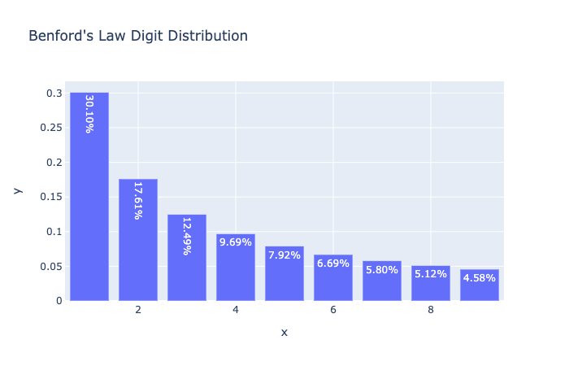
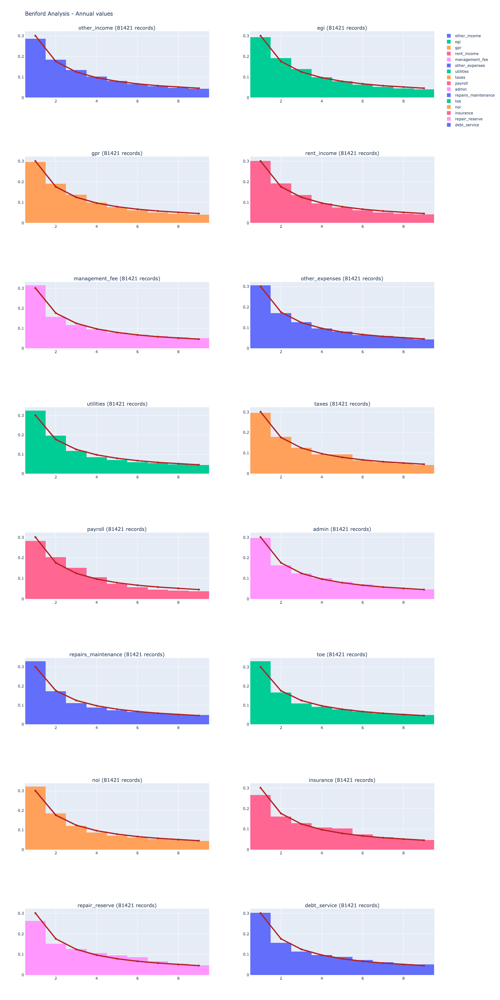
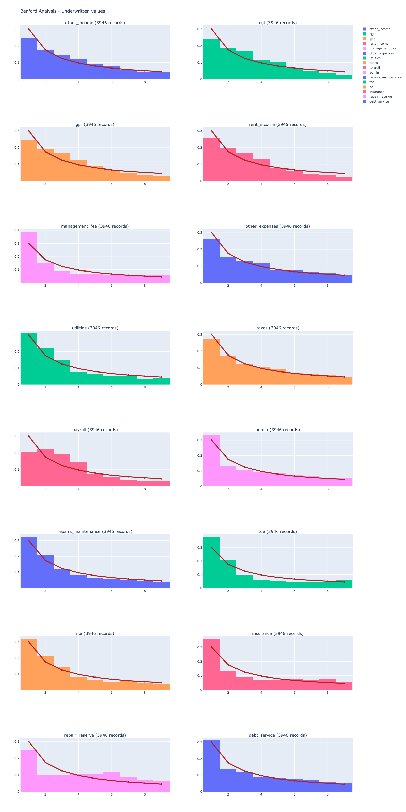

**Project**

Borrower's of Fannie Mae insured multifamily mortgages must submit annual financial statements for their properties. Lenders, when making a Fannie Mae insured loan, submit underwritten projections of the property's annual financial performance.

We look at both borrower provided annual financial statements and lender submittd underwritten statements to see if they conform to Benford's Law. Benford's law has been used to detect anomalies in datasets due to, for instance, fraud.

["How Forensic Accountants Use Benford's Law To Detect Fraud"](https://www.businessinsider.com/benfords-law-to-detect-financial-fraud-2014-12#:~:text=Most%20naturally%20occurring%20data%20sets,data%20and%20identify%20red%20flags)

["Netflix Documentary - Connected: Digits"](https://www.netflix.com/gb/title/81031737)

**Definition**

Benford's "law" is an observation that given a large enough set of numerical datapoints, if you take the first digit from each data point, the frequency of the first digit being a 1 or 2 or subsequent follows a predictable pattern.

For instance, if we look at all of the reported rental incomes for properties in the Fannie Mae portfolio, the data points' first digit should conform to benford's law.

**The Digit Distribution**

According to Benford's law, the distrbution should follow approximately the following formula:

$\log_{10}(1 + \frac{1}{d})$ where d is the digit in $d \in{1 \dots 9}$

Which turns out to look like:

*Source: [wikipedia](https://en.wikipedia.org/wiki/Benford%27s_law)*

**Example**

Looking at Annual Financials Nationwide seem to conform:

Looking at Florida specific, looks odder:

**Conclusions**

This analysis isn't complete. However, it seems Fannie Mae financial data tends to follow Benford's Law. This means that sets of data that do not follow are worth taking a closer look.

From here, it may be worth creating a Benford Detection function that can look at values across all states, cities, lenders and other filter types to look for anomalies to the rule.
